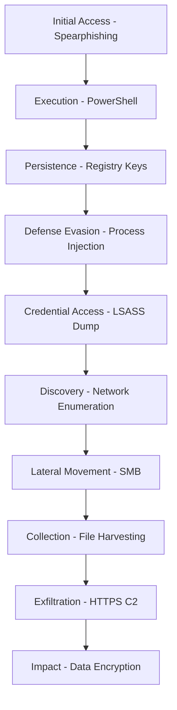

# MITRE ATT&CK Technique Mapping for APT Emulation

## Current Implementation vs. Real APT Techniques

### Currently Implemented Techniques

| MITRE ID | Technique | Current Implementation | Sophistication Level |
|----------|-----------|----------------------|---------------------|
| T1082 | System Information Discovery | Basic hostname, OS, user info | Basic |
| T1056.001 | Keylogging | Simple pynput keylogger | Basic |
| T1041 | Exfiltration Over C2 Channel | HTTP POST to C2 server | Basic |
| T1105 | Ingress Tool Transfer | Basic file creation | Basic |

### Missing Critical APT Techniques

#### Initial Access (TA0001)
| MITRE ID | Technique | Implementation Priority | Red Team Value |
|----------|-----------|----------------------|----------------|
| T1566.001 | Spearphishing Attachment | High | Critical for realistic scenarios |
| T1566.002 | Spearphishing Link | High | Social engineering simulation |
| T1190 | Exploit Public-Facing Application | Medium | Web app penetration testing |
| T1078 | Valid Accounts | High | Credential-based access |

#### Execution (TA0002)
| MITRE ID | Technique | Implementation Priority | Red Team Value |
|----------|-----------|----------------------|----------------|
| T1059.001 | PowerShell | High | Windows environment standard |
| T1059.003 | Windows Command Shell | High | Basic command execution |
| T1053.005 | Scheduled Task/Job | High | Persistence mechanism |
| T1047 | Windows Management Instrumentation | Medium | Living-off-the-land |

#### Persistence (TA0003)
| MITRE ID | Technique | Implementation Priority | Red Team Value |
|----------|-----------|----------------------|----------------|
| T1547.001 | Registry Run Keys | High | Common persistence method |
| T1053.005 | Scheduled Task/Job | High | Reliable persistence |
| T1543.003 | Windows Service | Medium | System-level persistence |
| T1574.001 | DLL Search Order Hijacking | Medium | Advanced persistence |

#### Privilege Escalation (TA0004)
| MITRE ID | Technique | Implementation Priority | Red Team Value |
|----------|-----------|----------------------|----------------|
| T1055 | Process Injection | High | Stealth and privilege escalation |
| T1134 | Access Token Manipulation | Medium | Privilege escalation |
| T1068 | Exploitation for Privilege Escalation | Low | Requires specific exploits |

#### Defense Evasion (TA0005)
| MITRE ID | Technique | Implementation Priority | Red Team Value |
|----------|-----------|----------------------|----------------|
| T1027 | Obfuscated Files or Information | High | Anti-detection |
| T1055 | Process Injection | High | Hide malicious code |
| T1112 | Modify Registry | High | Disable security features |
| T1497 | Virtualization/Sandbox Evasion | Medium | Anti-analysis |
| T1070.001 | Indicator Removal on Host | Medium | Cover tracks |

#### Credential Access (TA0006)
| MITRE ID | Technique | Implementation Priority | Red Team Value |
|----------|-----------|----------------------|----------------|
| T1003.001 | LSASS Memory | High | Credential harvesting |
| T1003.002 | Security Account Manager | High | Local credential extraction |
| T1552.001 | Credentials In Files | Medium | File-based credential search |
| T1110 | Brute Force | Low | Noisy but effective |

#### Discovery (TA0007)
| MITRE ID | Technique | Implementation Priority | Red Team Value |
|----------|-----------|----------------------|----------------|
| T1087.001 | Local Account Discovery | High | User enumeration |
| T1087.002 | Domain Account Discovery | High | AD enumeration |
| T1018 | Remote System Discovery | High | Network mapping |
| T1083 | File and Directory Discovery | Medium | Data discovery |
| T1057 | Process Discovery | Medium | Running process enumeration |

#### Lateral Movement (TA0008)
| MITRE ID | Technique | Implementation Priority | Red Team Value |
|----------|-----------|----------------------|----------------|
| T1021.001 | Remote Desktop Protocol | High | Common lateral movement |
| T1021.002 | SMB/Windows Admin Shares | High | Network propagation |
| T1047 | Windows Management Instrumentation | Medium | Remote execution |
| T1550.002 | Pass the Hash | Medium | Credential reuse |

#### Collection (TA0009)
| MITRE ID | Technique | Implementation Priority | Red Team Value |
|----------|-----------|----------------------|----------------|
| T1113 | Screen Capture | High | Visual intelligence |
| T1125 | Video Capture | Medium | Advanced surveillance |
| T1115 | Clipboard Data | High | Credential interception |
| T1005 | Data from Local System | High | File collection |

#### Command and Control (TA0011)
| MITRE ID | Technique | Implementation Priority | Red Team Value |
|----------|-----------|----------------------|----------------|
| T1071.001 | Web Protocols | High | HTTPS C2 communication |
| T1071.004 | DNS | Medium | Covert channel |
| T1573.001 | Symmetric Cryptography | High | Encrypted communications |
| T1090 | Proxy | Medium | Traffic obfuscation |

#### Exfiltration (TA0010)
| MITRE ID | Technique | Implementation Priority | Red Team Value |
|----------|-----------|----------------------|----------------|
| T1041 | Exfiltration Over C2 Channel | Implemented | Basic data exfiltration |
| T1567.002 | Exfiltration to Cloud Storage | High | Realistic data theft |
| T1020 | Automated Exfiltration | Medium | Systematic data collection |

---

## Implementation Roadmap by APT Group Profiles

### APT29 (Cozy Bear) Simulation
**Focus**: Stealth, Living-off-the-Land, PowerShell
```python
Priority Techniques:
- T1059.001: PowerShell execution
- T1027: Code obfuscation  
- T1071.001: HTTPS C2
- T1055: Process injection
- T1087.002: Domain enumeration
```

### APT28 (Fancy Bear) Simulation  
**Focus**: Credential harvesting, Lateral movement
```python
Priority Techniques:
- T1003.001: LSASS memory dumping
- T1021.002: SMB lateral movement
- T1550.002: Pass the hash
- T1087.001: Local account discovery
- T1113: Screen capture
```

### APT1 (Comment Crew) Simulation
**Focus**: Data collection, Exfiltration
```python
Priority Techniques:
- T1005: Local data collection
- T1083: File/directory discovery
- T1041: C2 exfiltration
- T1547.001: Registry persistence
- T1018: Network discovery
```

---

## Technical Implementation Examples

### Enhanced System Discovery (T1082)
```python
def advanced_system_discovery():
    """Enhanced system information gathering"""
    info = {
        'basic': get_basic_system_info(),
        'network': get_network_configuration(),
        'security': detect_security_software(),
        'domain': get_domain_information(),
        'processes': enumerate_processes(),
        'services': enumerate_services(),
        'software': get_installed_software(),
        'users': enumerate_users(),
        'privileges': get_current_privileges()
    }
    return info
```

### Process Injection (T1055)
```python
def process_injection(target_process, payload):
    """Inject payload into target process"""
    # DLL injection, Process hollowing, or Reflective DLL loading
    techniques = [
        'dll_injection',
        'process_hollowing', 
        'reflective_dll_loading',
        'atom_bombing',
        'process_doppelganging'
    ]
    return execute_injection_technique(target_process, payload, techniques)
```

### Credential Harvesting (T1003.001)
```python
def harvest_credentials():
    """Extract credentials from memory and files"""
    credentials = []
    
    # LSASS memory dumping
    credentials.extend(dump_lsass_memory())
    
    # SAM database extraction  
    credentials.extend(extract_sam_database())
    
    # Browser credential extraction
    credentials.extend(extract_browser_credentials())
    
    # File-based credential search
    credentials.extend(search_credential_files())
    
    return credentials
```

### Lateral Movement (T1021.002)
```python
def lateral_movement_smb(target_hosts, credentials):
    """Propagate to remote systems via SMB"""
    successful_compromises = []
    
    for host in target_hosts:
        for cred in credentials:
            if attempt_smb_connection(host, cred):
                if deploy_payload_via_smb(host, cred):
                    successful_compromises.append(host)
                    break
    
    return successful_compromises
```

---

## Realistic APT Campaign Simulation

### Multi-Stage Attack Chain


### Timeline-Based Execution
```python
campaign_timeline = {
    'day_1': ['initial_access', 'basic_persistence'],
    'day_2-7': ['reconnaissance', 'credential_harvesting'],
    'day_8-14': ['lateral_movement', 'privilege_escalation'],
    'day_15-30': ['data_collection', 'exfiltration'],
    'day_30+': ['advanced_persistence', 'impact']
}
```

This comprehensive mapping provides a roadmap for transforming the basic keylogger into a sophisticated APT emulation platform that accurately reflects real-world threat actor behaviors and techniques.